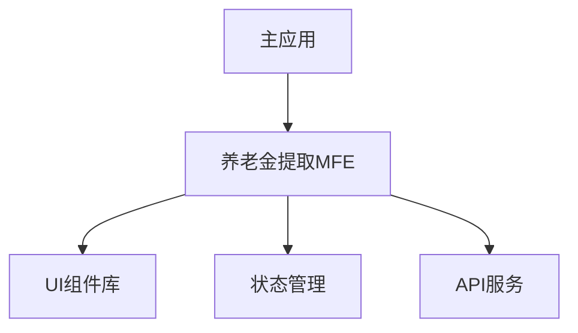

# 养老金提取流程微前端方案

## 架构概览



## 技术栈选型

- 微前端框架: Module Federation
- UI框架: React + Material-UI
- 状态管理: 内置状态管理 + 事件总线
- 构建工具: Webpack 5
- 类型系统: TypeScript

## 模块设计

### 1. 组件导出
```typescript
// pension-withdrawal/src/index.ts
import { PensionWithdrawalFlow } from './components/PensionWithdrawalFlow';
import type { FlowConfig, FlowProps, FlowRef } from './types';

export { PensionWithdrawalFlow };
export type { FlowConfig, FlowProps, FlowRef };
export { createFlowConfig, validateFlowData, getFlowStatus } from './utils';
```

### 2. 组件接口
```typescript
interface FlowProps {
  // 基础配置
  config: {
    apiBase: string;           // API基础路径
    totalPension: number;      // 总养老金额度
    theme?: DeepPartial<Theme>;// 主题覆盖
  };
  // 事件处理
  onComplete?: (result: SubmitResult) => void;
  onCancel?: () => void;
  onError?: (error: FlowError) => void;
  // 状态同步
  onStateChange?: (state: FlowState) => void;
  // UI定制
  components?: {
    Button?: ComponentType<ButtonProps>;
    Card?: ComponentType<CardProps>;
    // ... 其他可覆盖的组件
  };
  // 验证器扩展
  validators?: Record<string, ValidatorFn>;
}

interface FlowRef {
  start: () => void;
  reset: () => void;
  goToStep: (stepId: string) => void;
  getCurrentStep: () => string;
  getStepData: (stepId: string) => any;
  validate: () => Promise<ValidationResult>;
}
```

## 构建配置

### 1. Module Federation 配置
```javascript
// pension-withdrawal/webpack.config.js
module.exports = {
  plugins: [
    new ModuleFederationPlugin({
      name: 'pensionWithdrawal',
      filename: 'remoteEntry.js',
      exposes: {
        './PensionFlow': './src/index.ts',
      },
      shared: {
        react: { singleton: true },
        'react-dom': { singleton: true },
        '@mui/material': { singleton: true }
      }
    })
  ]
};
```

### 2. 样式隔离配置
```javascript
module.exports = {
  module: {
    rules: [
      {
        test: /\.scss$/,
        use: [
          'style-loader',
          {
            loader: 'css-loader',
            options: {
              modules: {
                localIdentName: '[name]__[local]__[hash:base64:5]'
              }
            }
          },
          'sass-loader'
        ]
      }
    ]
  }
};
```

## 集成指南

### 1. 主应用集成
```typescript
// host-app/src/pages/PensionPage.tsx
import { lazy, Suspense } from 'react';
import { ThemeProvider } from '@mui/material';

const PensionWithdrawalFlow = lazy(() => import('pensionWithdrawal/PensionFlow'));

const PensionPage: React.FC = () => {
  return (
    <Suspense fallback={<LoadingSpinner />}>
      <ThemeProvider theme={appTheme}>
        <PensionWithdrawalFlow
          config={{
            apiBase: '/api/pension',
            totalPension: 100000,
            theme: {
              palette: {
                primary: appTheme.palette.primary
              }
            }
          }}
          onComplete={handleComplete}
          components={{
            Button: AppButton,
            Card: AppCard
          }}
        />
      </ThemeProvider>
    </Suspense>
  );
};
```

### 2. 状态同步
```typescript
// 事件定义
export enum FlowEvents {
  STEP_CHANGE = 'PENSION_FLOW_STEP_CHANGE',
  DATA_UPDATE = 'PENSION_FLOW_DATA_UPDATE',
  VALIDATION = 'PENSION_FLOW_VALIDATION',
  COMPLETE = 'PENSION_FLOW_COMPLETE'
}

// 事件总线
class FlowEventBus {
  static emit(event: FlowEvents, data: any) {
    window.dispatchEvent(new CustomEvent(event, { detail: data }));
  }

  static on(event: FlowEvents, handler: (data: any) => void) {
    window.addEventListener(event, (e: CustomEvent) => handler(e.detail));
  }
}

// 主应用中监听事件
useEffect(() => {
  const handleStepChange = (e: CustomEvent) => {
    const { step, data } = e.detail;
    // 处理步骤变化
  };
  
  FlowEventBus.on(FlowEvents.STEP_CHANGE, handleStepChange);
  return () => {
    window.removeEventListener(FlowEvents.STEP_CHANGE, handleStepChange);
  };
}, []);
```

## 性能优化

### 1. 代码分割
```typescript
const StepComponents = {
  'tax-calculation': lazy(() => import('./steps/TaxCalculation')),
  'investment-choice': lazy(() => import('./steps/InvestmentChoice'))
};
```

### 2. 资源预加载
```typescript
const PensionWithdrawalFlow: React.FC<FlowProps> = (props) => {
  useEffect(() => {
    const nextStep = getNextStep(currentStep);
    if (nextStep) {
      const NextStepComponent = StepComponents[nextStep];
      NextStepComponent.preload?.();
    }
  }, [currentStep]);
};
```

### 3. 依赖共享策略
- 核心依赖（React, Material-UI）设置为singleton
- 业务组件库通过shared配置共享
- 工具函数库允许并行加载

## 错误处理

### 1. 错误边界
```typescript
class FlowErrorBoundary extends React.Component<{ onError?: (error: Error) => void }> {
  static getDerivedStateFromError(error: Error) {
    return { hasError: true, error };
  }

  componentDidCatch(error: Error, errorInfo: React.ErrorInfo) {
    this.props.onError?.(error);
  }

  render() {
    if (this.state.hasError) {
      return <ErrorFallback error={this.state.error} />;
    }
    return this.props.children;
  }
}
```

### 2. 错误上报集成
```typescript
interface ErrorReporter {
  captureError: (error: Error, context?: any) => void;
  captureMessage: (message: string, level?: string) => void;
}

const errorReporter: ErrorReporter = {
  captureError: (error, context) => {
    // 实现错误上报逻辑
  },
  captureMessage: (message, level) => {
    // 实现消息上报逻辑
  }
};
```

## 开发指南

### 1. 本地开发
```bash
# 启动MFE开发服务器
cd pension-withdrawal
npm run dev

# 启动主应用（需要配置代理）
cd host-app
npm run dev
```

### 2. 调试技巧
- 使用 `localStorage.debug = 'pension-flow:*'` 启用调试日志
- 使用 React DevTools 的组件树检查器
- 使用 Network 面板监控模块加载

### 3. 发布流程
```bash
# 1. 构建MFE
npm run build

# 2. 版本管理
npm version patch

# 3. 发布
npm publish
```

## 最佳实践

1. **依赖管理**
   - 核心依赖版本锁定
   - 使用peerDependencies声明共享依赖
   - 定期更新依赖版本

2. **样式管理**
   - 使用CSS Modules隔离样式
   - 遵循BEM命名规范
   - 主题变量统一管理

3. **性能优化**
   - 懒加载非首屏组件
   - 预加载下一步骤
   - 合理使用缓存策略

4. **测试策略**
   - 单元测试覆盖核心逻辑
   - 集成测试验证组件交互
   - E2E测试保证流程完整性
